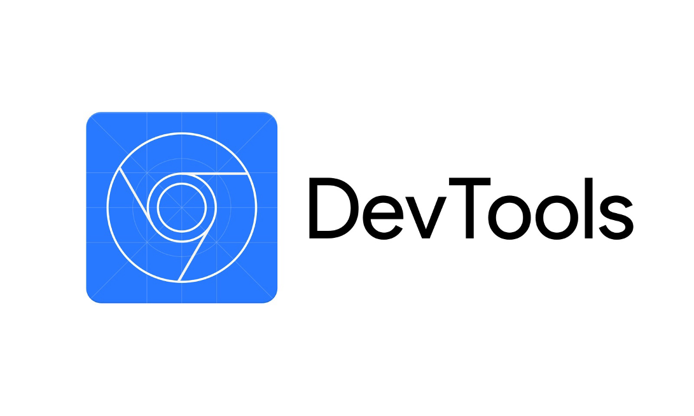

# Devops Tools

## What is DevOps?
DevOps is a set of practices that combines software development and IT operations.
It aims to shorten the systems development life cycle and provide continuous delivery
with high software quality. DevOps is complementary with Agile software development;
several DevOps aspects came from the Agile methodology.

## What Are DevOps Tools?
DevOps works in the cross-functional mode, involving various tools of various kinds and
purposes, instead of just a single tool. These tools are also known as DevOps toolchains,
as discussed above.
The tools help throughout the software production lifecycle, including development,
management, and delivery.
The organization that uses DevOps practice coordinates these tools and fits each one of
them into one or more production activities like planning, creation, verification,
packaging, releasing, configuring, monitoring, and version control.
We have segmented various DevOps tools based on the production activities that they
can fit into.

## 1. DevOps Automation Tools
These are some of the popular DevOps automation tools:

### 1.1 Jenkins

<a>  
    

</a>

[Jenkins](https://www.jenkins.io/) is an open source and free automation server that helps automate software
development processes such as building, facilitating CI/CD, deploying, and testing.
This DevOps tool makes it easy for teams to monitor repeated tasks, integrate changes
easily, and identify issues quickly.

Features and Benefits:

- Jenkins supports 100+ plugins to integrate with almost every tool available in
the CI/CD toolchain, such as Git, Amazon EC2, Maven, etc.
- It’s a self-contained program written in Java that works across major platforms,
including Windows, macOS, Linux, and Unix systems.
- You can set and configure Jenkins easily using its simple web interface with
built-in error checks and helps.
- Jenkins is super extensible through plugins, so you can perform a range of
additional functionalities.
- Since it’s extensible, Jenkins can easily be used as a CI/CD tool for any software
development project.
- As it’s a Java-based DevOps tool, you can easily distribute it across machines
to accelerate builds, tests, as well as deployments

### 1.2 Docker

<a>  
    

</a>

A leader in software containerization, [Docker](http://docker.com) is used by 11 million+ developers across the world. Solomon Hykes is its original author and it was released in 2013 by Docker, Inc.
As a DevOps tool, Docker helps developers to build, package, and then deploy the codes with ease and speed via containers with needed dependencies instead of virtual machines. It eliminates mundane configuration activities and fosters effective team collaboration.
Docker ensures that the same software development environment is maintained across every stage of a DevOps cycle, from development to staging and production. It empowers the developers to create Docker images that they can run in the development environment and operation teams to perform testing and deployments.

Features and Benefits:

- Docker uses OS-level virtualization to deliver applications in packages referred to as a container. It isolates these containers from each other and bundles the software, configuration files, and libraries, making them transferable and more secure.
- It works easily with GCP and AWS and simplifies cloud migration
- Docker facilitates distributed development
- The tool makes it easy to add features and perform fixes
- Docker runs in Windows, macOS, and Linux
- It integrates well with deployment pipeline tools like CircleCI, GitHub, etc.
- It offers both open source and commercial solutions
- Docker is used by enterprises like Netflix, Adobe, AT&T, PayPal, etc.

### 1.3 Puppet

<a>  
    

</a>

Developed by Puppet, Inc. and founded in 2005 by Luke Kanies, [Puppet](https://puppet.com) is an open-source tool for software configuration management.
This DevOps automation tool helps manage different software lifecycle stages such as provisioning of IT infrastructure, patching, and configuration & management of software components and OS across cloud infrastructures and data centers.

Features and Benefits:

- It’s written in C++, Ruby, and Clojure and works with Windows, Linux, and Unix-like operating systems.
- Puppet is a model-driven tool that needs limited use of programming language.
- It uses a declarative language of its own to define system configuration
- It helps reduce manual errors and supports your team to scale with infrastructure as Code and agentless automation
- Puppet’s commercial software offers out-of-the-box reporting, node management, orchestration, product support, and access control

### 1.4 Apache Maven

<a>  
    

</a>

Developed by the Apache Software Foundation and released in 2004, [Maven](https://maven.apache.org/) is an efficient build automation tool. Written in Java, it’s used mainly for Java-based projects and acts as a project management and a comprehension tool.
As a DevOps tool, it helps manage the build, documentation, and reporting of a project. Apart from Java-based projects, you can also use Maven to develop and manage software projects written in Ruby, C#, Scala, and others.

Features and Benefits:

- Maven has predefined targets to perform well-defined tasks like code compilation and packaging.
- It downloads Maven plugins and Java libraries from its repositories to help accelerate the development process.
- It has the Apache License 2.0
- Maven comes with excellent dependency management such as automatic updating, transitive dependencies, and dependency closures.

### 1.5 Gradle

<a>  
    

</a>

Accelerate your software development productivity using Gradle. [Gradle](https://gradle.org) is also amongst open-source DevOps tools for build automation, especially for multi-language application or software development.
Gradle is written in Java, Kotlin, and Groovy and was released in 2007. It’s used to automate software development, testing, and deployment at improved speeds.

Features and Benefits:

- Gradle has a rich API along with an advanced ecosystem of integrations and plugins to help with automation so that you can develop, integrate, and then systematize end-to-end software delivery.
- It has the Apache License 2.0
- Introduces a Kotlin based and Groovy-based DSL
- Uses directed acyclic graphs to prioritize tasks to run via dependency management.
- It helps you scale out your development easily with blazing-fast builds.
- Useful for developing mobile applications to microservices
- It’s versatile and can be used by start-ups and enterprises both

### 1.6 Gulp

<a>  
    

</a>

[Gulp](https://gulpjs.com) is yet another tool from open-source community to automate repetitive tasks in web development. While tools like bower, npm (Node Package Manager) helps us to download and configure re-usable packages in our application, Gulp helps us to automate many of the time-consuming repetitive client-side tasks.

These are tasks like bundling and minifying scripts and style sheets, compiling less or sass to CSS styles, deploying files to servers, image compressing, etc. So, in simple terms Gulp is a task runner tool while tools like Bower, npm are package managers.

Gulp is built upon Node.js and it already has a strong community that builds various plugins for performing various tasks. There are currently more than 3000+ plugins available here which makes almost every possible task we can think of can be automated. The gulp tasks are writted in JavaScript file called gulpfile.js which will be executed by Gulp tool.

### 1.7 Graphite

<a>  
    

</a>

[Graphite](https://graphiteapp.org) is a highly scalable real-time graphing system. As a user, you write an application that collects numeric time-series data that you are interested in graphing, and send it to Graphite’s processing backend, carbon, which stores the data in Graphite’s specialized database. The data can then be visualized through graphite’s web interfaces.

Anybody who would want to track values of anything over time. If you have a number that could potentially change over time, and you might want to represent the value over time on a graph, then Graphite can probably meet your needs.

Specifically, Graphite is designed to handle numeric time-series data. For example, Graphite would be good at graphing stock prices because they are numbers that change over time. Whether it’s a few data points, or dozens of performance metrics from thousands of servers, then Graphite is for you. As a bonus, you don’t necessarily know the names of those things in advance (who wants to maintain such huge configuration?); you simply send a metric name, a timestamp, and a value, and Graphite takes care of the rest!

## DevOps Pipeline (CI/CD) Tools
Some of the best CI/CD DevOps tools are:
### 2.1 [CircleCI](https://circleci.com/)
<a>  
    

</a>
No matter your DevOps team size, this cloud-native CI/CD tool CircleCI offers reliability and speed for your software development process.
You can develop and deploy high-performing software on your infrastructure or in the cloud at scale quickly.
CircleCI was founded in 2011, and now it runs around 35M+ builds per month. It’s used by leading companies such as Spotify, PagerDuty, Ford Motor Company, Samsung, and more.
Features and Benefits:

- CircleCI runs your CI/CD pipeline automatically in a virtual machine or clean container to facilitate easy tests.
- In case of pipeline failures, it notifies your team immediately. You can also automate notifications using their Slack integration.
-	Performs automated deployment of codes to a different environment to enable quick time-to-market.
-	It integrates with Bitbucket and GitHub to create pipelines for your code commitments.
-	It runs on Windows, macOS, Linux, and supports Docker.
-	Allows you to orchestrate and define task execution for better control of the workflow.
-	Supports many languages such as JavaScript, C++, PHP, Python, .NET, Ruby, etc. along with innumerable frameworks, toolchains, or versions.
-	Provides powerful caching options such as source codes, images, customer caches, and dependencies to speed up pipelines and achieve optimal performance.
-	Let’s you find and resolve issues using SSH access.
-	Offers unmatched security with full VM isolation, LDAP user management, etc.
-	Provides a powerful insights dashboard to track status and duration, and optimize your pipelines.

### 2.2 [Bamboo](https://www.atlassian.com/software/bamboo)
<a>  
    

</a>
The DevOps team chose Bamboo by Atlassian for continuous integration, continuous deployment, and delivery of software applications. You can tie your automated builds, releases, and tests together as one workflow.
As s DevOps tool, it helps you create build plans in multiple stages, set up triggers, and allocate agents to critical builds as well as deployments
It’s available both as free and paid software. For developing an open-source software project, Bamboo is free while charging commercial organizations based on the build agents required.
Features and Benefits:

-	Supports several builds
-	Includes an intuitive and user-friendly user interface
-	Features tips, tools, and auto-completion
-	With pre-built functionalities, the automation pipeline of Bamboo needs less configuration time than Jenkins
-	Enables parallel automated tests to regress products thoroughly corresponding to each change, making bug caching faster and easier
-	Integrates with many build tools and code repositories such as Git, Mercurial, JIRA, Bitbucket, Crucible, Fisheye, etc.

### 2.3 [TeamCity](https://www.jetbrains.com/teamcity/)
<a>  
    

</a>
Released in 2006, TeamCity by JetBrains is a robust continuous integration tool for DevOps teams. It’s a general-purpose CI/CD DevOps tool that offers greater flexibility for different types of development and workflow practices.
From developers and DevOps engineers to managers and admins; TeamCity is loved by all. You can build, deploy, and test applications, containers, and packages of different types be it multi-cloud, multi-language, or multi-platform.
It’s written in Java and is available for both free and paid plans. The free license comes with a maximum of 3 build agents and 100 configurations.
Features and Benefits:

-	Hundreds of plugins are available for free to install with a few clicks
-	Gated commits to stop developers from breaking source codes in version control systems
-	Real-time reporting for faster issue resolves
-	Integrated inspections, code coverage, duplicate search, etc.
-	Build Grid to allow multiple tests and builds running on different environments and platforms simultaneously
-	Supports Java, Ruby, and .NET platforms
-	Supports Git, Subversion, Mercurial, etc. version control systems
-	Integrates with IDEs like Visual Studio, Eclipse, and IntelliJ IDEA

### 2.4 [Travis CI](https://www.travis-ci.com/)
<a>  
    

</a>
Best suited for open-source projects, Travis CI is an efficient continuous integration (CI) tool to develop and test applications hosted on GitHub or Bitbucket. It was written in Ruby and has an MIT license.
This cloud-hosted service detects all the new code commits automatically and how many codes are pushed to your GitHub repository to help you build the software and test it accordingly.
Features and Benefits:

-	Quick setup and compatible with Linux, Mac, and iOS
-	Supports Java, Python, PHP, Perl, etc.
-	It features automatic deployments
-	Offers clean VMs for each build
-	Comes with pre-installed databases, live-build statistics, and Parallel testing
-	Offers an enterprise-level access control for superior security
-	Provides an on-demand scaling capacity

### 2.5 [Buddy](https://buddy.works/)
<a>  
    

</a>
If you find an effective DevOps tool for CI/CD to build your software faster, Buddy can be your best ‘buddy’. This tool helps in continuous integration and deployment along with feedback.
It’s suitable for projects using codes from GitHub and Bitbucket repositories. It also allows you to use Docker containers in addition to pre-installed frameworks and languages to build the software, and also monitors and sends alerts.
Features and Benefits:

-	Comes with a user-friendly and simple user interface
-	Offers faster deployments with change detection, parallelism, advanced caching, 360-degree optimizations, RAM and vCPU scaling, etc.
-	Allows you to perform 100+ actions such as running SSH commands, Docker images, generating static sites, orchestrating Kubernetes clusters, using RPM tools, and more apart from building and deployments
-	Integrates with Selenium, MariaDB, Redis, Memcached, Firefox, Chrome, and more
-	Features workflow management using templates to import and export pipelines and cloning

### 2.6 [GoCD](https://www.gocd.org/)
<a>  
    

</a>
GoCD is an open-source tool which is used in software development to help teams and organizations automate the continuous delivery (CD) of software. It supports automating the entire build-test-release process from code check-in to deployment. It helps to keep producing valuable software in short cycles and ensure that the software can be reliably released at any time. It supports several version control tools including Git, Mercurial, Subversion, Perforce and TFVC (a la TFS). Other version control software can be supported by installing additional plugins. GoCD is released under the Apache 2 License.

### 2.7 [Mercurial](https://www.mercurial-scm.org)
<a>  
    

</a>
Mercurial is a distributed revision control tool for software developers. It is supported on Microsoft Windows and Unix-like systems, such as FreeBSD, macOS, and Linux.
Mercurial's major design goals include high performance and scalability, decentralization, fully distributed collaborative development, robust handling of both plain text and binary files, and advanced branching and merging capabilities, while remaining conceptually simple. It includes an integrated web-interface. Mercurial has also taken steps to ease the transition for users of other version control systems, particularly Subversion. Mercurial is primarily a command-line driven program, but graphical user interface extensions are available. TortoiseHg, and several IDEs offer support for version control with Mercurial. 

### 2.8 [Azure DevOps Pipelines](https://azure.microsoft.com/en-us/products/devops/)
<a>  
    

</a>
Azure Pipelines automatically builds and tests code projects to make them available to others. It works with just about any language or project type. Azure Pipelines combines continuous integration (CI) and continuous delivery (CD) to test and build your code and ship it to any target.
Continuous Integration (CI) is the practice used by development teams of automating merging and testing code. Implementing CI helps to catch bugs early in the development cycle, which makes them less expensive to fix. Automated tests execute as part of the CI process to ensure quality. Artifacts are produced from CI systems and fed to release processes to drive frequent deployments. The Build service in Azure DevOps Server helps you set up and manage CI for your applications.
Continuous Delivery (CD) is a process by which code is built, tested, and deployed to one or more test and production environments. Deploying and testing in multiple environments increases quality. CI systems produce deployable artifacts, including infrastructure and apps. Automated release processes consume these artifacts to release new versions and fixes to existing systems. Monitoring and alerting systems run continually to drive visibility into the entire CD process.
Continuous Testing (CT) on-premises or in the cloud is the use of automated build-deploy-test workflows, with a choice of technologies and frameworks, that test your changes continuously in a fast, scalable, and efficient manner.

### 2.9 [Chrome DevTools](https://developer.chrome.com/docs/devtools/)
<a>  
    

</a>
Chrome DevTools is a set of tools that are designed to help you in front-end development. You can enhance your website by addressing styling errors and assessing changes in real-time. Learn how to utilize Chrome DevTools to use this tool as a sandbox for experimenting with the website styles and code. You are not required to do any further configuration because Chrome DevTools are embedded inside your web browser. These developer tools are highly recommended since they assist you in editing the style of your website, completing DOM-related operations, debugging JavaScript, and improving website speed.

Other DevOps CI/CD tools : Sublime Text, etc.

## DevOps Version Control Tools
Version control DevOps tools are:
### 3.1 [Git](https://git-scm.com/)
<a>  
    

</a>
One of the most widely recognized DevOps tools, Git’s an open source and free version control software. Released in 2005, it was written in C, Perl, Shell, and Tcl, and originally authored by Linus Torvalds.
This distributed source code management (SCM) tool is used to track changes in files for software development and coordinate work effectively among programmers. It aims at increasing the speed, support, and data integrity for non-linear, distributed workflows.
Each Git directory over a computer is fully-fledged with complete version-tracking capability and history.
Features and Benefits:

-	Works on Windows, macOS, Linux, Solaris, and AIX
-	It has the GPL v2 license
-	Can handle projects of different scales, from small to large projects while maintaining efficiency and speed
-	Easy to learn and use by beginners and experts alike
-	Provides a competitive edge with features like convenient staging environments, multiple workflows, commits, check-in, and multiple local branching
-	To integrate it with your workflow, host repositories from GitHub or Bitbucket so your team can push tasks easily

### 3.2 [GitHub](https://github.com/)
<a>  
    

</a>
Millions of companies and developers trust GitHub to build, manage, and ship their software. This is the world’s most advanced and largest development platform. It provides web hosting for your software development as well as its version control utilizing Git.
Written in Ruby, C, Go, and ECMAScript, it was launched in 2008. Currently, it’s used by 56+ million users and 3M+ organizations in the world.
GitHub offers source code management and distributed version control features of Git apart from its functionalities. Its basic services are free, and that’s why it’s used to host open-source projects mostly.
Features and Benefits:

-	Demonstrates improved access controls
-	Offers collaboration features like task management, bug tracking, continuous integration, feature requests, and wikis
-	Comes with unlimited private and public repositories
-	Enables you to share your projects using GitHub packages and npm
-	Its mobile app helps you merge or review codes, browser repositories, manage notification, etc. with ease
-	Available for Windows, macOS, and Linux and you can work using GitHub CLI or desktop

### 3.3 [Bitbucket](https://bitbucket.org/product)
<a>  
    

</a>
Bitbucket is Git repository management which is specially developed for professional teams. The central hub to handle all the repositories of git is collaborated on the source code and guide all through the software development cycle. It is a section of the Atlassian family with tools such as Confluence, Jira, and others to support the technical teams to explore the entire potential. The deployment of Bitbucket is made in three different options. They are Bitbucket cloud, Bitbucket data center, and Bitbucket Server.
The Bitbucket is used in access control, pull request, workflow control, integration of Jira, full rest API. The restriction of source code is provided by Bitbucket, which has access control. The enforcement of a project or team is made using workflow control, and the pull requests are carried within the inline comment to collaborate on the code reviews. The traceability of the entire development is done by Jira integration.
The entire API is made to develop features to configure the workflow if it not instantly available. The Bitbucket Cloud is deployed on the servers of Atlassian, and it is enabled using URL. It has an extensive in-built persistent integration tool. The pipelines allow the user to develop, test and execute instantly along with Bitbucket. The Bitbucket server is hoisted directly on-premises, which is in the user environment. But it doesn’t have the option of in-built testing and deployment, and so it is strongly connected to Bamboo, which is the robust continuous integration and persistent delivery that makes the process automated.

### 3.3 [Gitlab](https://gitlab.com/)
<a>  
    

</a>

GitLab is a popular, open-source Git hosting solution implemented by more than 50,000 organizations. Over the last few years, GitLab has evolved with strong community support and growth, handling thousands of users on a single server and several such servers on an active cluster.
GitLab is a self-hosted system for managing your code. It was first released in October 2011, and is updated every twenty-second day of the month since then. It was released under the MIT license.
This is a simplified architecture diagram that can be used to understand GitLab’s architecture. A complete architecture diagram is available in our component diagram.

## DevOps Configuration Management Tools

Look at some of the best DevOps tools for configuration management:
## [chef](https://www.chef.io/)
<a>  
    

</a>
One of the oldest DevOps tools, Chef is an open-source configuration management solution released in 2009.
You can use Chef to streamline the configuration and maintenance of your servers. It can also integrate with various cloud-based solutions such as Amazon EC2, Microsoft Azure, Google Cloud Platform, etc. to configure and provision new machines automatically.
It ensures that all the nodes are connected in an IT infrastructure and makes it effortless to add more nodes into it without manual updates.
Features and Benefits:

-	Chef is written in Erlang and Ruby and utilizes a Domain Specific Language (DSL) that is pure Ruby for system configuration
-	It helps users adapt to rapidly changing business requirements with speed, consistency, and scale
-	Manages several cloud environments and data centers
-	Ensures high server availability
-	Chef runs in server/client mode, or as a standalone configuration tool
-	It supports various platforms, including Windows, macOS, Ubuntu, Solaris, FreeBSD, RHEL/CentOS, AIX, Fedora, and Debian.

## [Kubernetes](http://kubernetes.io/)
<a>  
    

</a>
Also referred to as K8s, Kubernetes is an open-source production-grade container orchestration system to automate the deployment, management, and scaling of contained-based software.
It was written in Go and developed originally by Google, and released in 2014, but now the Cloud Native Computing Foundation takes care of its maintenance.
As one of the best DevOps automation tools, Kubernetes is useful for applications packaged with many containers. It allows developers to isolate and package container clusters logically for easy deployment to several machines.
You can employ a master-slave node arrangement to automate the container scheduling and deployment and analyze and maintain node connectivity. Using Kubernetes, you can create Docker containers automatically and assign them based on demands and scaling needs.
Features and Benefits:

-	Kubernetes rolls out & rolls back changes progressively to software and/or its configuration and monitors its health
-	It provides an IP address to Pods and one DNS name to a bunch of Pods in addition to load-balancing across them.
-	Facilitates service traffic routing according to cluster topology
-	Offers multiple storage options from local to public clouds such as AWS or GCP, or network storage solutions like NFS, Gluster, etc.
-	Places containers automatically based on resources requirements without sacrificing availability
-	Manages batch CI and batch workloads
-	Allocates IPv6 & IPv4 addresses to services and Pods
-	Offers horizontal scaling using a UI, command, or according to CPU usage
-	Features Self-healing capabilities that allow restarting of containers on their failure, rescheduling and replacing them when a node dies and kills non-responding containers to health checks

## [Ansible](https://www.ansible.com/)
<a>  
    

</a>
Ansible is a leading open-source tool for software provision, deployment, and configuration management that enables infrastructure as code.
Written in Python, Shell, Ruby, and PowerShell, its original author is Michel DeHaan and was released in 2012. Now, Red Hat has acquired Ansible.
Being one of the renowned DevOps tools in the market, it simplifies software development automation during its entire lifecycle.
Features and Benefits:

-	It works agentless and connects via SSH/remote PowerShell to complete its tasks.
-	Runs on Windows, macOS, Linux, and Unix systems
-	It promotes easy scalability and faster productivity
-	Manages complicated deployments effortlessly
-	It’s a lighter alternative to Puppet and ideal for small teams
-	Integrates seamlessly with other tools like Jenkins
-	Eliminates repetitive tasks with YAML templates

## [Vagrant](https://www.vagrantup.com/)
<a>  
    

</a>
No matter your role, be it a developer, designer, or operator, in your DevOps team, Vagrant by HashiCorp offers the same, effortless workflow for everyone.
Vagrant was written in Ruby by Mitchell Hashimoto, and released in 2010. It’s an open-source software to build and maintain portable, lightweight, and reproducible virtual environments like Docker Containers, AWS, VMware, etc. for software development.
In DevOps, Vagrant simplifies configuration management of software to improve development productivity.
Features and Benefits:

-	Compatible with Windows, macOS, Linux, FreeBSD, Arch Linux, CentOS, and Debian
-	It comes with the MIT License
-	Uses declarative configuration files for software requirements, OS configuration, users, packages, and more
-	Offers flexibility of choosing your preferred editor, browser, debugger, and IDE
-	Integrates with other configuration management tools like Docker, Ansible, Puppet, Chef, and Salt to help you use the same configuration script as production

## [Consul](https://www.consul.io/)
<a>  
    

</a>
One of the best DevOps tools for configuration management is Consul by HashiCorp. It allows you to automate network configurations, use secure connections, and discover services across runtime or in the cloud. This tool is ideal for modern infrastructures.
Features and Benefits:

-	You can extend its functionality by integrity Consul with Kubernetes
-	Enables deployment of service mesh within an infrastructure or runtime
-	Offers dynamic load balancing using 3-party tools such as Nginx, HAProxy, or F5
-	Provides security to your services using mTLS encryption and intention-based policies
-	Detects and deploys new services and offers real-time agent health to lower downtimes
## [Terraform](https://www.terraform.io/)
<a>  
    

</a>
One of the notable Infrastructure as Code DevOps tools in the market is Terraform by HashiCorp. It’s an open source IaC tool that offers a consistent Command Line Interface (CLI) workflow to help you manage several cloud services.
Terraform was written in Go by Mitchell Hashimoto and was released in 2014. It incorporates HashiCorp Configuration Language (HCL), which is a declarative language to allow you to define and offer data center infrastructure. However, you can also use JSON optionally.
Features and Benefits:

-	Works on Windows, macOS, Linux, FreeBSD, OpenBSD, and Solaris
-	Comes with the Mozilla Public License v2
-	Supports HCL language that enables concise resource descriptions using arguments, expressions, and blocks
-	You can define IaC to manage software lifecycle processes such as creating new resources, destroying or managing existing ones
-	Automates resource provisioning and reduces human errors
-	Provisions infrastructure in over 300 services and public clouds using one workflow

# DevOps Testing Tools
Here are some DevOps tools for testing:
## [Selenium](https://www.selenium.dev/)
<a>  
    

</a>
If you are finding a resourceful DevOps tool to automate your software testing, Selenium is a good option. You can also use it to automate boring, web administration tasks.
Selenium is an open-source software released in 2018. It provides a portable framework to carry out the tests in addition to authoring functional tests with no need of learning a scripting language.
It offers a test DSL, Selenese that you can use to author tests in various programming languages such as Java, PHP, Python, C, Perl, Ruby, etc.
Features and Benefits:

It’s compatible with most web browsers, along with OS such as Windows, macOS, and Linux.
-	It has the Apache License 2.0
-	Selenium is highly extensible and flexible, therefore, ideal for DevOps
-	Supports parallel test execution
-	Integrates with 3rd-party tools like Docker, Jenkins, Maven, and more
-	It’s used by tech leaders, including Google, IBM, Salesforce, Cognizant, and others
## [Tricentis Tosca](https://www.tricentis.com/products/automate-continuous-testing-tosca)
<a>  
    

</a>
Accelerate software testing using an AI-based, scriptless tool of Tricentis Tosca that takes a no-code approach to perform end-to-end test automation. It combines different aspects of testing such as test automation, case design, data generation and design, and analytics.
Features and Benefits:

-	Tricentis Tosca leverages technologies related to Risk-based testing and Model-based testing to achieve higher test automation rates with easy maintenance
-	Offers many test automation capabilities to the DevOps team such as functional testing, load testing, BI/DWH testing, exploratory testing, packaged application testing, and facilitates test data management, test impact analysis, service virtualization, and distributed execution
-	Supports 160+ enterprise applications and technologies Salesforce, Adobe, Oracle, SAP, Java, .NET, HTML 5, and more.
## [TestSigma](https://testsigma.com/)
<a>  
    

</a>
Although new in the test automation arena, TestSigma is garnering fame due to its impressive offerings. It’s a cloud-based test automation DevOps tool for web, API, and mobile apps. It leverages AI for faster test execution and maintenance.
Features and Benefits:

-	Uses simple English for automated tests, hence, makes it easier for functional testers especially beginners
-	Provides a unified platform for DevOps and Agile teams to involve everyone in the team
-	Offers multiple types of testing such as continuous testing, mobile and web app testing, data-driven testing, cross-browser testing, and regression testing
-	Allows you to extend its capabilities by writing JS and Selenium-based functions
-	Enables parallel software testing to save cost and time
## [IBM Rational Functional Tester](https://www.ibm.com/products/rational-functional-tester)
<a>  
    

</a>
IBM RFT offers automated functional and regression testing in addition to data-driven and GUI testing. It simplifies test editing and visualization with the natural language plus rendered screenshots.
Features and Benefits:

-	RFT supports various web-based applications such as Java, .NET, SAP, and Siebel
-	Supports terminal emulator-based apps such as Ajax, PowerBuilder, Adobe Flex, Adobe PDF documents, Dojo Toolkit, etc.
-	Uses ScriptAssure technology to automate tests and enables test scripting
## [SoapUI](https://www.soapui.org/)
<a>  
    

</a>
Whether you are building a commercial or open-source software, SoapUI by SmartBear is an excellent option. It’s an open-source software testing DevOps tool for Representational State Transfers (REST) and Simple Object Access Protocol (SOAP).
It was released in 2005 and is the only open-source tool with a wide spectrum of testing capabilities such as functional, load testing, and security testing.
Features and Benefits:

-	Offers an easy-to-use graphical interface
-	Scriptless functional testing using drag-and-drop test creation
-	Provides API mocking for your software without waiting for its completion
-	Includes protocol support for REST, JMS, SOAP/WSDL
-	Enables quick swapping of environments
-	Provides 1-click test refactoring to update tests quickly
# DevOps Monitoring Tools
Next, let’s find out some DevOps tools for monitoring:
## [Nagios ](https://www.nagios.org/)
<a>  
    

</a>
When it comes to monitoring IT infrastructure, Nagios is one of the most efficient DevOps tools. It was written in C by Ethan Galstad and released in 2002.
Nagios is also an open source and free software that monitors infrastructure, systems, and networks. It offers alerting and monitoring services for applications, servers, logs, and switches. The DevOps tool aims to alert users in case of issues and notifies them when they resolve.
Features and Benefits:

-	Offers cross-platform compatibility, including Linux and Unix system
-	It has a GNU GPL v2 license
-	Monitors network services such as HTTP, FTP, SSH, POP3, SNMP, SMTP, NNTP, and ICMP
-	Also monitors host resources such as disk usage, processor load, system logs along with network OS like Windows via monitoring agents
-	Monitors hardware such as probes for alarms, temperature, etc.
-	Comes with a minimalist plugin design to help users develop service checks
-	It’s available in Nagios XI, Core, Log Server, and Fusion.
## [Prometheus](https://prometheus.io/)
<a>  
    

</a>
Power your alerting and metrics using a leading open-source monitoring software of Prometheus. It was written in Go and released in 2012.
It records metrics in real-time in a time-series database by using powerful queries and highly dimensional data models. Prometheus is popular among the teams leveraging Grafana.
Features and Benefits:

-	Offers cross-platform compatibility
-	It has the Apache License 2.0
-	Identifies time series by key-value pairs and metric names
-	Provides multiple modes of data visualization such as graphs, tables, etc. that makes it easy for the DevOps team to analyze data
-	Features PromQL that lets you divide time series data into smaller chunks for easier generation of ad-hoc tables, graphs, and alerts
-	Stores data on local disks and memory in a custom format efficiently. You can scale easily with the help of functional sharding & federation
-	Offers multiple easy-to-implement client libraries for effortless service instrumentation and supports 10+ languages
-	Supports data exporting from 3rd-party solutions such as JMX metrics, StatsD, HAProxy, and DevOps tools like Docker.
## [New Relic](https://newrelic.com/)
<a>  
    

</a>
Using New Relic, you can produce better-performing software by analyzing, troubleshooting, and optimizing your overall software stack.
New Relic is a technology company founded in 2008. The platform reflects every change you make in your program with clarity.
Apart from showing the real-time status of the developmental processes, it also helps you fix issues, accelerate deploy cycles, and manage related tasks, ticking off major criteria to be a resourceful DevOps tool.
Features and Benefits:

-	Enables you to gather all the telemetry data in a single place for AI-driven insights and full-stack observability, speeding up time-to-market and improve service reliance
-	If you use Grafana or Prometheus environment, then also you can store data such as logs, events, traces, and metrics in New Relic
-	Transitioning to a data-driven approach from reactive can help improve your customer experience
## [PagerDuty](https://newrelic.com/)
<a>  
    

</a>
Improve your customer experiences and protect your brand’s reputation using the real-time operations monitoring platform of PagerDuty.
As one of the most useful DevOps tools, it can help your team achieve less downtime, more productivity, and fewer outages using automation and machine learning.
Features and Benefits:

-	PagerDuty is easy to use and scale
-	Acting as your digital infrastructure’s nervous system, PagerDuty analyses digital signals out of software systems virtually
-	With the quick incident response, you can automate tasks across teams, accelerate resolutions, and execute in-depth playbooks
-	Offers alerting and task scheduling to help you take prompt actions
-	Uses ML for incident context, personalized recommendations, and real-time triaging
-	Supports 370+ integrations with tools such as Slack, AWS, Atlassian, Zendesk, New Relic, and more.
## [Sensu](https://sensu.io/)
<a>  
    

</a>
Sensu is undoubtedly one of the best DevOps tools out there for monitoring IT infrastructure. It helps you monitor servers, applications, network devices, and containers along with checking application health, measuring business KPI, and gathering and analyzing metrics.
It was written in pure Ruby and was released in 2011. It utilizes Redis for data storage and rabbitMQ for data exchanges between two components. It’s designed for use in cloud environments with server automation tools such as Ansible, Puppet, etc.
Companies using Sensu are Tesla, Yahoo, Cisco, and others.
Features and Benefits:

-	It’s a cohesive tool that offers extensibility and compensability
-	Sends alerts on issues and failures immediately
-	Provides the option to register or deregister clients dynamically
-	Works fine with multi-tiered networks and mission-critical applications
-	It’s available as both free and plan license
## [Splunk](https://www.splunk.com/)
<a>  
    

</a>
Monitor your infrastructure performance at cloud scale in real-time using Splunk’s predictive streaming analytics.
Splunk helps search, monitor, and analyze machine-generated big data using a web-like interface. It allows you to auto-discover, group, breakdown, and explore systems, services, and clouds.
Features and Benefits:

-	Offers 200+ pre-built integrations with cloud services
-	Features a unique dashboard to enable rapid full-stack visualization
-	Lets you easily understand your infrastructure behavior across availability zones, different services, Kubernetes clusters, etc.
-	By leveraging data science (such as AI and ML), it alerts accurately and instantly on dynamic thresholds, complex rules, and multiple conditions to reduce team time-to-detect and alert storms
-	Helps you understand customer experiences by monitoring SLIs and SLOs with service-level insights
-	Using custom business KPI metrics, you can easily track how many products are sold, their cost/workload, etc. in real-time
-	Enables closed-loop automation like auto-scaling for a seamless end-user experience
## [ELK Stack](https://www.elastic.co/what-is/elk-stack)
<a>  
    

</a>
Logstash, & Kibana.
ELK stack allows you to aggregate logs out of your entire applications and systems, analyze logs, create visualizations for infrastructure and application monitoring, security analytics, quick troubleshooting, and more.
Elasticsearch is a RESTful, open source, distributed analytics and search tool built on Apache License. It supports various languages, offers high performance, includes schema-free JSON files, etc. that make this tool a great alternative for search and log analytics
Logstash is also an open-source tool for data ingestion that you can use to gather data from different sources, modify it, and send them to wherever you want. It supports 200+ plugins and pre-built filters.
Kibana is an open-source data exploration and visualization tool to review logs and events. It has effortless, pre-built, interactive filters and aggregations, and comes with geospatial support for data visualization
Other DevOps monitoring tools are Raygun, Ganglia, Snort, eG Enterprise, Datadog, and more.

## Bonus DevOps Tools
Apart from the above-mentioned DevOps tools for different stages of software development, there are so many more available for collaboration, planning, continuous feedback, security, etc.

-	Continuous feedback: Mouseflow, JIRA Service Desk, SurveyMonkey, SurveyGizmo, etc.
-	Collaboration: Slack, Basecamp, Asana, etc.
-	Planning: Atlassian Jira Align, Planview, Targetprocess, Trello, etc.
-	Cloud DevOps tools: Kamaterra, OpenStack, AWS, Google Cloud Platform, Azure, IBM Cloud, etc.
